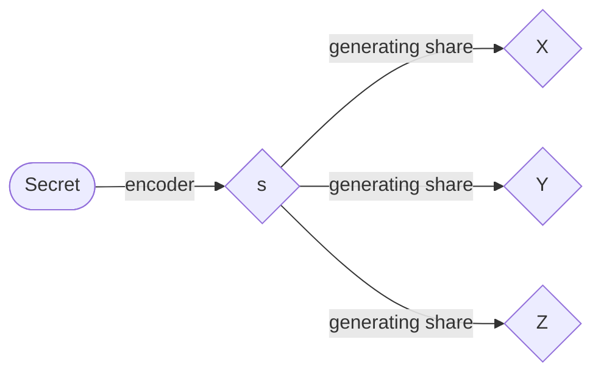

# $(n-1,n)$ threshold scheme
## Introduction
The secret sharing scheme is a security technique that consists of a fairly fundamental theory of information secrecy. Resistance to information leakage is one of the most popular research topics in this field, and papers on this research are presented every year at CRYPTO, a well-known international conference in the field of cryptography.
I am also working on this field in my laboratory. I will try to write about the results of my research so far, using as few technical terms as possible.

## The secret sharing scheme
The secret sharing scheme is a scheme for managing secret information in a distributed manner. The information after being distributed is generally called a share. For example, when messages are sent and received in secret, the original message is not known even if the transmitted information is seen by the receiver, because the shares are actually sent and received in a distributed manner. However, it is of course necessary to set up the share so that the original message can be restored at the receiving end.
This process is briefly described below. First, the secret information is encoded as an integer on a finite body $`\mathbb{F}_{p}`$. The first step is to encode the secret information into an integer on a finite body $`\mathbb{F}_{p}`$, where $`p`$ is a prime number. I'll spare you the detailed explanation of finite bodies, but a detailed explanation of bodies is given by
>ガロア理論12講 概念と直観でとらえる現代数学入門(加藤 文元,2022)

So if you are interested, check it out. Here it is $`\mathbb{F}_{p}=\lbrace0,1,\ldots,p-1\rbrace`$, and it is sufficient to understand that the four arithmetic operations are closed on the set by defining them in terms of the remainder operations (modulo operations) of $`p`$. Let $`s`$ be the encoded integer value, and $`n`$ be the number of shares, i.e., the number of partitions of $`s`$. The image of the process of generating shares when $`n=3`$ looks like this.

## How to encode for $(n-1,n)$ threshold scheme
The 1~n-2 shares are generated according to a uniform random numbers.
Let $X_{n-1}$ and $X_n$ be the shares of the n-1th and nth participant, and these are generated to satisfy the following simultaneous equations.

$$
s+\sum_{i=0}^nX_i=0
$$

$$
s+\sum_{i=0}^n\alpha^i X_i=0
$$

$\alpha$ is one of primitive elements of a finite body $`\mathbb{F}_{p}`$. In matrix form,

$$
\begin{bmatrix}
1 & 1 \\
\alpha^{n-1} & \alpha^n \\
\end{bmatrix}
\begin{bmatrix}
X_{n-1}\\
X_n
\end{bmatrix}
=-
\begin{bmatrix}
s+\sum_{i=0}^{n-2}X_i\\
s+\sum_{i=0}^{n-2}\alpha^i X_i
\end{bmatrix}
$$

$$
\begin{bmatrix}
X_{n-1}\\
X_n
\end{bmatrix}
=(\alpha -1)^{-1}
\begin{bmatrix}
-\alpha & (\alpha^{n-1})^{-1}\\
1 & -(\alpha^{n-1})^{-1}
\end{bmatrix}
\begin{bmatrix}
s+\sum_{i=0}^{n-2}X_i\\
s+\sum_{i=0}^{n-2}\alpha^i X_i
\end{bmatrix}
$$

## How to decode for $(n-1,n)$ threshold scheme
When n-1 shares are gathered, the only unknowns in the above simultaneous equations are the other share and the secret.
Furthermore, since the primitive element is not 1, the dimension of the coefficient matrix is 2.
So the simultaneous equations can be solved.
